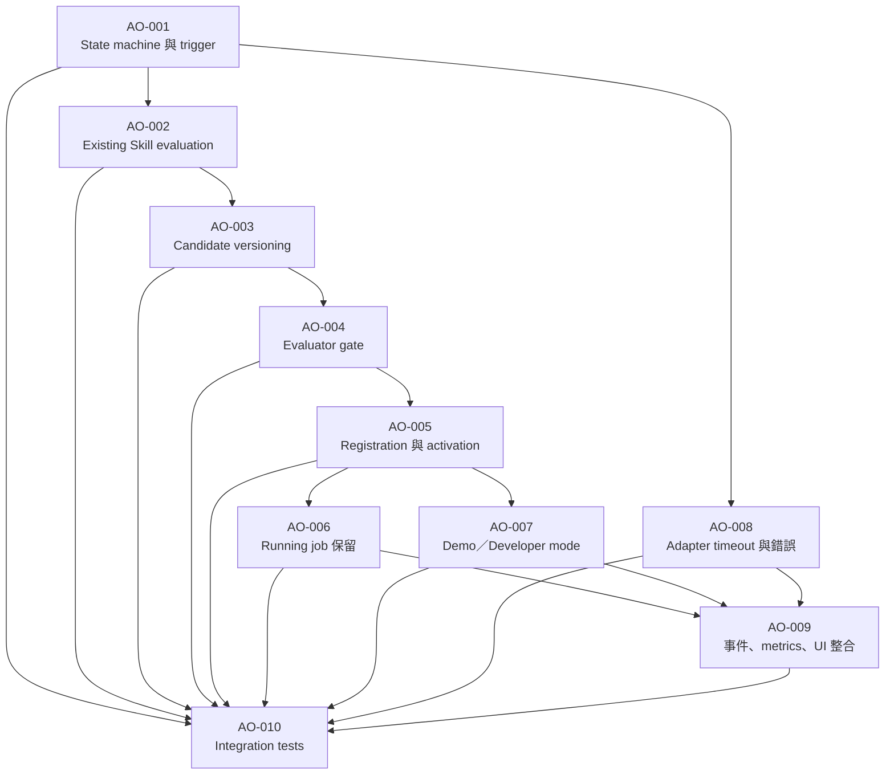

# Adaptive Scheduler Arena：Hackathon 總 PRD

## 1. 文件定位

本文件是 Adaptive Scheduler Arena 的產品總規格與 Hackathon 現場協作來源。它描述產品目標、Agent 閉環、shared contract、子 PRD 拆分、ticket 格式、驗證矩陣與 90 秒展示流程。

目前的 [`prd/Hackathon_DEMO_UI_PRD.md`](prd/Hackathon_DEMO_UI_PRD.md) 是本文件之下的可執行子 PRD，範圍限於 Gradio UI、Simulator、Adapter、Metrics 與瀏覽器驗收。它不再代表完整產品的全部需求，也不再繼續拆分。

Agent adaptation 的可執行子 PRD 為 [`prd/AGENT_ORCHESTRATION_PRD.md`](prd/AGENT_ORCHESTRATION_PRD.md)，其 tickets 位於 [`tickets/agent-orchestration/`](tickets/agent-orchestration/)。

本文件供開發者搭配 AI 使用。AI 必須先讀取本文件、相關子 PRD、[`CONTEXT.md`](../CONTEXT.md) 與目前 repository 狀態，再產生子 PRD 或 tickets。若子文件與本文件衝突，以本文件為準，並在子文件記錄差異。

## 2. 產品目標

建立一個可觀察、可驗證的 Adaptive Scheduler Arena：當訂單 workload 改變且現有排程策略無法維持服務指標時，Agent 能先重用既有 Skill；只有所有既有 Skill 都無法通過 evaluator，才產生新的 Candidate，在隔離 sandbox 中驗證，通過後自動加入 Skill Library 並於下一次 dispatch 啟用。

正式 Demo 中 User 不介入 policy switching，也不按 Candidate accept。User 只觸發 workload、控制播放與觀察 Agent 的決策證據。手動 policy switching 僅在 developer mode 用於測試。

### 2.1 成功條件

- 評審能看見 workload 改變、指標惡化、Agent 診斷與 policy 變更原因。
- Agent 先評估現有 Skills；有效時不建立新的 Candidate。
- 所有既有 Skills 失敗時，Planner 與 Critic 能最多迭代 5 個 Candidate 版本。
- 通過 evaluator 的 Candidate 自動註冊 Skill 並於下一次 dispatch 生效。
- live Run、sandbox evaluation 與 policy segment metrics 分開呈現。
- 三個 Gradio tabs、動畫、Skill Library、metrics 與事件紀錄對應同一份 Snapshot。
- 90 秒展示可完整走完正常 workload → Flash Sale → adaptation → 自動啟用的流程。

## 3. 名詞與角色

| 名詞 | 定義 |
|---|---|
| Policy | Worker 選擇下一筆 job 的排序規則。 |
| Skill | 已通過 evaluator、可正式使用並存入 Skill Library 的 policy。 |
| Candidate | 尚未通過 evaluator 的新 policy 版本。 |
| Planner | 讀取 workload 與 metrics，提出或修正 Candidate。 |
| Evaluator | 在 sandbox 中以固定 baseline 比較既有 Skill 或 Candidate。 |
| Critic | 分析 sandbox 執行結果與失敗原因，提供 Planner 修正 feedback。 |
| Live Run | 正式展示中的模擬狀態。 |
| Sandbox Run | 供 evaluator 比較策略的隔離狀態，不得修改 Live Run。 |
| Policy segment | 某一 policy 連續生效的時間區段。 |

初始 Skill 只有 FIFO、SJF、Priority、EDF。Hybrid 的排序函式可以存在於程式中，但 Hybrid 不是基礎 Skill；它必須通過 evaluator 才能登錄。Reset 會移除所有後續新增的 Skill，恢復四個初始 Skills。

## 4. Agent 自動 adaptation

### 4.1 固定流程

```text
Workload 改變
→ 指標達到 adaptation trigger
→ Evaluator 測試所有既有且已驗證的 Skills
→ 若有 Skill 通過：選最佳 Skill 並自動啟用
→ 若全部失敗：Planner 產生 Candidate
→ Sandbox 執行 Candidate
→ 失敗：Critic feedback 回傳 Planner
→ Planner 最多產生 5 個版本
→ 通過 evaluator：註冊 Skill 並自動切換
→ 下一次 dispatch 使用新 policy
```

### 4.2 既有 Skill 優先

每個既有 Skill 必須使用相同的 workload、random seed、初始 simulator state、evaluation window 與 baseline policy。

若目前 policy 已通過，維持目前 policy，不建立 Candidate。若其他 Skills 通過，固定依下列順序選擇：

1. expired count 最低。
2. completed count 最高。
3. P95 completion latency 最低。
4. 與目前 policy 相同者優先。
5. `skill_id` 字典序。

選定既有 Skill 後記錄 `existing_skill_reused` 事件，並於下一次 dispatch 啟用。

### 4.3 Candidate 迭代

只有在所有既有 Skills 未通過 evaluator、失敗原因已記錄，且尚未達到 5 版上限時，Planner 才能建立 Candidate。

Candidate 使用不可重複的 ID，例如：

```text
hybrid-v1 → hybrid-v2 → hybrid-v3 → hybrid-v4 → hybrid-v5
```

每個 Candidate 記錄 `candidate_id`、`parent_candidate_id`、產生原因、Critic feedback、policy code、適用 workload 與 evaluator 結果。執行錯誤、契約違反或指標未改善都必須回饋 Planner；5 版全部失敗時維持原 policy，不建立 Skill。

### 4.4 Evaluator gate

Evaluator 對既有 Skill 與新 Candidate 使用同一標準：

- expired count 必須下降；或在 expired count 相同時，completed count 增加且 P95 不惡化。
- completed count 不得下降。
- P95 latency 不得惡化。
- 必須通過 Job 欄位、deadline、單 worker、不搶占與事件順序檢查。
- policy code 必須在 sandbox 執行並產生有效 Snapshot。
- metrics 必須完整且可序列化。

Evaluator 結果必須保留 baseline metrics、candidate metrics、主要指標、退化項目、Critic feedback 與通過／拒絕原因。

## 5. Demo 與 Developer mode

### 5.1 Demo mode

Demo mode 是預設模式。User 可以播放、暫停、單步、重設、調整倍速與注入 workload；不能手動切換 policy，也不能批准 Candidate。

UI 必須顯示：

- 指標惡化原因。
- 現有 Skill evaluation 結果。
- Candidate 版本與 Critic feedback。
- evaluator gate 結果。
- Skill 註冊事件。
- policy 自動切換原因與生效時間。
- 資料來源與 evaluator 是否為 Mock。

外部 LLM、Planner 或 evaluator 失效時停止 adaptation 並明示錯誤，不自動切換 Mock。Mock 只能明確指定為離線開發模式。

### 5.2 Developer mode

```powershell
uv run python app.py --mode developer
```

Developer mode 提供 policy dropdown、手動套用已驗證 Skill、policy switching 測試、segment metrics 測試與 Skill Library adapter 測試。它不是正式評審展示流程。

## 6. Architecture 與 shared contract

總體架構由下列可替換 adapter 組成，不固定 LLM 供應商：

```text
Gradio UI
  → Session / Integration Controller
    → SchedulerBackendAdapter
    → PlannerAdapter
    → EvaluatorAdapter
    → CriticAdapter
```

必要介面：

```text
detect_adaptation_trigger(snapshot)
evaluate_existing_skills(context)
select_existing_skill(results)
propose_candidate(context, feedback)
evaluate_candidate(candidate_id, baseline_run)
register_skill(candidate_id)
activate_skill(skill_id)
```

Adapter 必須定義輸入／輸出 schema、timeout、錯誤狀態、sandbox 與 live Run 隔離、Candidate 版本、evaluator 結果、Critic feedback，以及 `run_id`／`snapshot_version` 關聯。

### 6.1 Metrics 分層

- **Live Run metrics**：整局混合 policy 的完成數、逾期數、吞吐量與 P95。
- **Policy segment metrics**：每個 policy 生效區段的結果。
- **Existing Skill evaluation**：相同 workload 下各既有 Skill 的 sandbox 結果。
- **New Candidate evaluation**：各 Candidate 版本的 sandbox 結果。

Sandbox 結果不可冒充 live Run 改善結果。正在執行的 job 不因 policy 啟用而中斷；新 policy 從下一次 dispatch 生效。

### 6.2 最小資料物件

Shared contract 至少包含：

- `Job`：ID、arrival、processing time、priority、deadline、status、開始／完成時間、派工 policy 與 segment。
- `Skill`：ID、規則、code、來源、驗證狀態、使用紀錄。
- `Candidate`：ID、版本、父版本、code、產生原因、feedback、狀態。
- `EvaluationResult`：baseline、candidate metrics、gate、錯誤、Critic feedback。
- `Event`：時間、類型、相關 job／policy／candidate ID 與原因。
- `Snapshot`：run ID、版本、模擬時間、jobs、worker、policy、metrics、segments、adaptation 與 events。

## 7. 子 PRD 與 tickets 生成規格

AI 產生子 PRD 時，輸入固定為：

```text
本總 PRD
目前 repository 狀態
隊友能力與限制
Hackathon 剩餘時間
```

每份子 PRD 必須輸出：

1. 子 PRD ID、目標與範圍。
2. 依賴的 shared contract。
3. 輸入／輸出介面。
4. 狀態與錯誤行為。
5. 驗收條件。
6. 測試案例。
7. 風險與未完成項。
8. 對應 tickets。

每張 ticket 必須使用以下格式，粒度控制在約 1–4 小時：

```text
Ticket ID：
標題：
目標：
背景：
前置條件：
實作範圍：
涉及介面或檔案：
驗收條件：
測試要求：
依賴 ticket：
完成定義：
```

預先定義的子 PRD 類別：

- Agent orchestration：詳見 [`prd/AGENT_ORCHESTRATION_PRD.md`](prd/AGENT_ORCHESTRATION_PRD.md) 與 [`tickets/agent-orchestration/`](tickets/agent-orchestration/)。
- Scheduler backend：job lifecycle、dispatch、policy 與 metrics。
- Sandbox evaluation：baseline／candidate isolation 與 evaluator gate。
- Skill Library：Skill 註冊、版本、重用與來源。
- UI／Gradio：三個 tabs、demo/developer mode 與 SVG 動畫。
- Shared contract：Job、Policy、Skill、Candidate、EvaluationResult、Event、Snapshot。
- Integration：adapter、session、版本一致性與錯誤恢復。
- Demo：90 秒展示、資料來源標籤與 runbook。

總 PRD 目前提供生成規格，不自動建立 `tickets/` 檔案；現場可由 AI 依此格式產生並貼到 issue 或協作工具。

### 7.1 Tickets Dependency Graph

下圖描述 Agent Orchestration tickets 的前置條件。箭頭由前置 ticket 指向後續 ticket；圖表是依賴關係的單一視圖，不改變各 ticket 的功能規格。



開發時遵循以下規則：`AO-001` 是唯一的起始 ticket；`AO-002` 至 `AO-006` 形成主要功能鏈；`AO-007` 與 `AO-008` 在其前置條件完成後可並行；`AO-009` 等待 activation、mode、錯誤與事件資料；`AO-010` 等待所有前置工作並作為整合驗證關卡。Ticket 完成前，不得宣告依賴它的 ticket 完成。介面變更時，必須同步總 PRD、Agent Orchestration 子 PRD 與受影響 tickets。

每次分派前確認前置 ticket 已有測試證據、shared contract 欄位與方法名稱已凍結、並行工作沒有寫入同一核心區段。新增 ticket 時必須同時加入此圖的節點與依賴邊，以避免孤立工作。

## 8. 驗證矩陣與展示

### 8.1 必要測試

- 五種 policy、平手規則與不可行 job。
- deadline 邊界與同時刻事件順序。
- 不同 `advance(dt)` 切分的一致性。
- Existing Skill reuse：有效時不建立 Candidate。
- 多個既有 Skill 通過時的固定選擇順序。
- Candidate 失敗回饋、最多 5 版與全部失敗處理。
- Candidate 通過後自動註冊與下一次 dispatch 啟用。
- running job 不被中斷。
- sandbox 不修改 live Run。
- 整局、segment、existing evaluation 與 candidate evaluation metrics 分離。
- Demo mode 禁止 User policy switch；Developer mode 可手動切換。
- 外部 LLM／adapter timeout 時停止 adaptation 並顯示錯誤。

### 8.2 90 秒 Demo runbook

```text
0–15 秒：正常 workload，說明一個 worker 與目前 policy。
15–30 秒：注入 Flash Sale，展示 workload 與指標惡化。
30–45 秒：Agent 評估既有 Skills；若有效，展示 existing_skill_reused。
45–65 秒：若全部失敗，展示 Planner、Candidate 版本與 Critic feedback。
65–75 秒：展示 evaluator 通過與 Skill 自動註冊。
75–85 秒：展示 policy 自動切換，下一次 dispatch 使用新 Skill。
85–90 秒：展示 Skill Library、live metrics 與 sandbox metrics 的區分。
```

展示時不得把 User 手動操作說成 Agent 決策，也不得宣稱單一 Run 的混合 metrics 證明新 policy 在所有 workload 都更好。

## 9. Hackathon 里程碑

| 時間 | 完成條件 |
|---|---|
| 0–1 小時 | 凍結 shared contract；外部 adapter 可建立 session、reset、snapshot。 |
| 1–2.5 小時 | Simulator、policy、metrics、既有 Skill evaluation 與 contract tests。 |
| 2.5–4.5 小時 | Sandbox isolation、Planner／Critic 迭代與 Candidate lifecycle。 |
| 4.5–6 小時 | Gradio 三 tabs、demo/developer mode、動畫與事件顯示。 |
| 6–7 小時 | Skill Library、automatic registration／activation 與 metrics 分層。 |
| 7–8 小時 | 外部 LLM 整合、錯誤恢復、瀏覽器驗收與 90 秒排練。 |

## 10. 明確限制

- 正式 Demo 必須能接 provider-neutral 的外部 LLM adapter；若尚未接通，必須標示 Mock，不能冒充完成。
- 不執行未經 sandbox 驗證的動態 policy code。
- 不加入 Round Robin、worker failure、多 worker、完整長期 evaluator 或非必要的登入／部署功能。
- User 手動 policy switching 只屬 developer mode。
- 新增或修改 shared contract 必須先更新 contract 文件與測試，再讓各子 PRD 重新產生 tickets。
